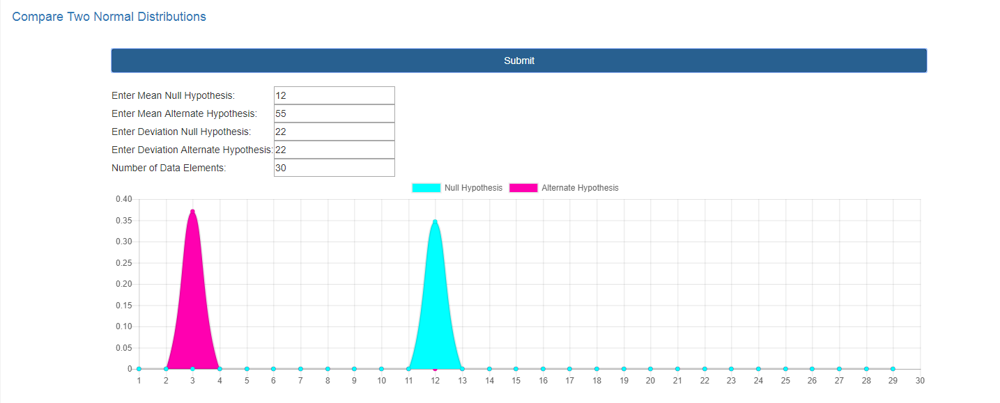

# Compare-Two-Normal-Distributions
This site allows a user to compare a null hypothesis against an alternate from values entered
 
 
This is a django based website using ajax to interact with the dom to call chart.js library that generates graphs. 
The numbers entered by the user in the form are passed as a json to the post view function. In views.py the 
python numpy scipy.stats libraries are used to calculate the normal distributions and determine the p-value. 

